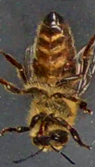

# VarroaDataset 🐝

This is the repository for the *VarroaDataset*.

Purpose of this dataset is to provide high resolution images (160x280px) of honeybees, recorded in a controlled and constant environment.

We further provide:

* ~4000 manual annotations of honeybees infected with the parasite *Varroa Destructor*.
* Predefined dataset splits into: train, test and validation subsets

## Dataset Statistics

Parameter | Total | Train | Test | Val  
|----|---|---|---|---|
\# of samples           | 13,509    | 8,225  | 3,408  |  1,876   |
\# pos (infected)       | 3,947     | 2,554  | 942  |  451   |
\# neg (healthy)        | 9,562    | 5,671  | 2,466  | 1,425  |  
ratio [pos:neg]         | 1 : 2.4    | 1 : 2.2  | 1 : 2.6  | 1 : 3.1    |
resolution [w x h]      |  160 x 280px |  |  |  

### Examples of healthy bees (class 0):


### Examples of infected bees (class 1):





## Creation Process


**I.** The dataset was recorded using the device presented in:

```
Schurischuster, S., Zambanini, S., Kampel, M. and Lamp, B., 2016, December. Sensor study for monitoring varroa mites on honey bees (apis mellifera). In Visual Observation and Analysis of Vertebrate and Insect Behavior Workshop.
```

**II.**  Individual honeybees are detected and extracted from the recorded videos

**III.** Manual labeling of infected honeybees.

## Usage

The overall dataset is organized as presented in the `sample` directory with sub-folders: `train`, `test` and `val`.
Each of the sub-folders provides a `gt_one.csv` holding the manual annotations in the csv format for each line

```
[path_to_image_file] [label] [bounding_box_coordinate_top_left_0] [bounding_box_coordinate bottom_right_0] bounding_box_coordinate_top_left_1] [bounding_box_coordinate bottom_right_1] ... [bounding_box_coordinate_top_left_n] [bounding_box_coordinate bottom_right_n]
```

## Download

Full download links will be provided soon.
